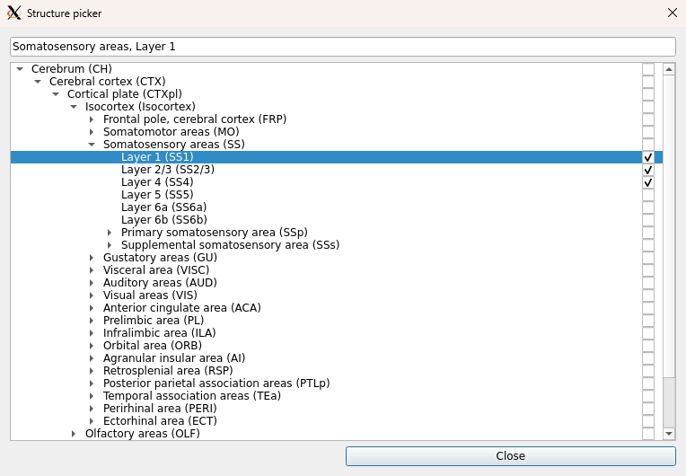

Using the built-in quantification available in `histalign` is very much optional and might not perfectly suit your needs. Currently, only average fluorescence in a 2D or 3D brain area (i.e., per-slice or per-brain) is available, although cell counting might be made available in the future using [`cellpose`](https://github.com/MouseLand/cellpose). If you require another way to quantify volumes, you should use the [export option](volume-building.md#exporting-3d-volumes) in the menu bar and run your own quantification on the volumes.  

However, if the capabilities of `histalign` are suitable for your needs, you can click on the "Quantification" tab to be taken to a GUI that looks like this:

## Quantification parameters

Just like [volume building](volume-building.md), quantification allows you to provide a few quantification parameters to specify what to quantify.

### Quantification

This is the type of quantification to carry out. Currently, this is limited to average fluorescence.

### Directory

This is the image directory you wish to quantify.

### Run on volume

If you have previously built a volume for the selected image directory, the "Run on volume?" toggle will be available. If you toggle it on, the quantification will be run on the built volume, otherwise the quantification is run on the individually registered slices.

### Multi-channel images

When working with 2D slices, you can pick to run the quantification on a different channel than was aligned. See [working with multi-channel images](volume-building.md#working-with-multi-channel-images) for more details.

## Picking (a) structure(s)

Below the quantification parameters, you can find a "Structures" area with an "Add/remove structures" button.  
This area allows you to specify which structures you are interested in, and selecting (a) structure(s) will limit the quantification to the selection.

Clicking the "Add/remove structures" button will pop up a small dialog allowing you to check target structures from the CCF hierarchy.

You can navigate the hierarchy using the expand/collapse arrows or search structures using their name or acronym.  
To select a structure for quantification, simply check the check box on the same line as the structure.

When you are done picking structures, simply close the pop-up using the close button. The structure will now be listed in the area below the pop-up button. If you decide you don't actually want some of these structures, you can right-click them or click on their \[X\] icon.

### Navigating the tree

You can navigate the hierarchy tree using the keyboard.

To move around, use the up and down arrows.  
To expand a node, use the right arrow.  
To collapse a node, use the left arrow.
To move to the parent of a collapsed node, use the left arrow.  
To clear the selection, use the Escape key.

### Search shortcuts

When using the search bar, pressing Enter will find the next match while Shift-Enter will find the previous one. Both searches will cycle back to the first/last one when running out of matches in the search direction.

## Queueing a job

Once you have selected your target structure(s), you can click the "Add job" button to queue a quantification with the provided parameters and structure(s). If you are running quantification on slices, the "slices" column will now have an entry with a summary of the job, while the "volumes" column will be the one with a job if you selected to run it on a volume.  
You can queue the jobs you want to run like this (and remove them using the \[X\] button) and then run them all at once with the "Run jobs" button.

While jobs are running, you will not be able to queue new jobs, and you should avoid closing the application. A progress bar at the bottom will inform you of the overall progress for all the jobs. It will show as "Finished" when all queued jobs have been processed.

## Examining results

Jobs that have been processed will produce an artifact that can be seen in the "Results" sub-tab of quantification.  

In the "Results" tab, you can see a list of the quantifications you have run so far for the whole project. This allows you select (using the check boxes in the first column) the quantifications you are interested in and export them as one excel file using the "Export" button at the bottom of the window.  
This excel file can then be used for your own analysis based on the quantification result(s).

## What's next?

The final functionality of `histalign` is basic 2D and 3D visualisation. For a guide on how to do that, see the [visualisation tutorial](visualisation.md).
