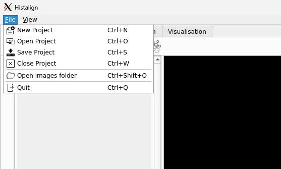
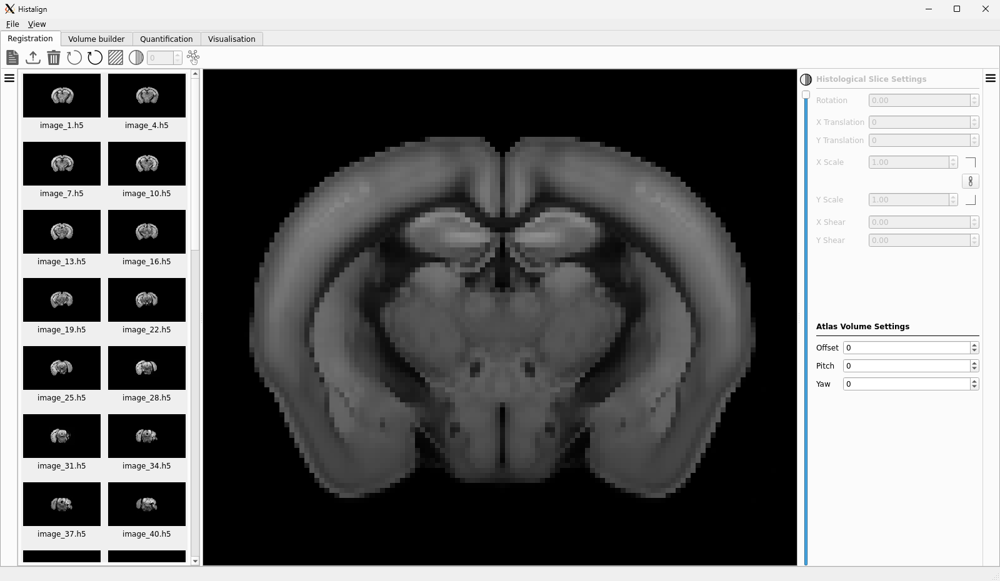
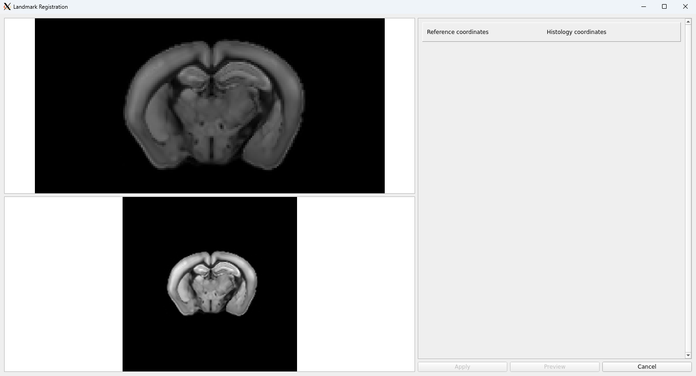

Now that you have a project open, you can go back to the same menu your used from the menu bar to create your project. The option to "open images folder" should not be available:

Clicking it will open a dialog to allow you to pick which directory to open. Once you have navigated to the folder, click on it to select it and then click the "choose" button to submit the dialog. The left pane will now populate itself with thumbnails of the images that were discovered in that folder.

!!! info
    If you find that there aren't any thumbnails being populated, have a look at the command line you started the application from. If you see a warning message mentioning that no images were found, make sure that the images in the folder were properly prepared as indicated in the [data preparation](data-preparation.md) tutorial.  
    If after double checking your data is properly formed you still don't see any thumbnails appearing when opening the folder, you should have a look at the [GitHub issues](https://github.com/DuguidLab/histalign/issues?q=is%3Aissue) and [open your own](https://github.com/DuguidLab/histalign/issues/new) if you do not find an answer.

If all went well, you should have a similar-looking interface with your own thumbnails in the left pane.

## Registering your first image

To open an image in the central view, double click it in the thumbnail pane.  

Now that you have an image opened in the main view, you can begin alignment.  
The right pane provides granular control of parameters for transforming your image and fit it to the CCF using [affine transformations](https://en.wikipedia.org/wiki/Affine_transformation#Image_transformation).

!!! info
    At any point during registration, you can use the slider located between the middle and right panes to control the transparency of your image over the atlas.
    To quickly toggle between fully opaque and fully transparent, you can press Ctrl+T on Windows and Linux (Cmd+T on macOS) to toggle the visibility of the image to better see the atlas. Alternatively, you can click the  button above the slider.

## Image settings

### Rotation

This is the clockwise rotation in degrees to apply to your image.

### Translation

These are the X and Y translations in atlas pixel to apply to your image.

!!! note
    The coordinates have their origin in the top-left, increasing in X towards the right and increasing in Y towards the bottom of the screen.

### Scale

These are the X and Y scalings to apply to your image. The X and Y axes are the same as for translation.

!!! note
    Scaling is by default applied on both axes at the same time, essentially acting as a zoom. If you wish to apply non-uniform scaling, you can unlink the two by clicking the  button between the two input boxes. You can at any point link them back with  to re-enable uniform scaling.

### [Shear](https://en.wikipedia.org/wiki/Shear_mapping)

These are the X and Y shear factors to apply to your image.

!!! note
    X shear pulls the top-left corner of your image to the left and the bottom-right corner to the right. Meanwhile, Y shear pulls the top-left corner of your image up and the bottom-right corner down.

## Volume settings

### Offset

This is the offset from the centre of volume along the [project orientation](your-first-project.md#orientation).  

When working with a coronal orientation, increasing the offset moves more rostral and reducing it moves more caudal.  
When working with a horizontal orientation, increasing the offset moves more ventral and reducing it moves more dorsal.  
When working with a sagittal orientation, increasing the offset moves towards the right and reducing it moves towards the left.  

### Pitch

This is the pitch in degrees of the plane used to slice the atlas. You can imagine this as tilting forward (increasing pitch) and tilting backward (decreasing pitch).

### Yaw

This is the yaw in degrees of the plane used to slice the atlas. You can image this as turning to the right (increasing yaw) or turning to the left (decreasing yaw).

## Get a feel for it

You should play around a bit with the different parameters until you're comfortable with them.  

For larger changes in the parameters, you can left click in the input boxes and drag up or down to change the value quickly.  
Additionally, you can drag your image around with left click to change the translation or use the mouse wheel to change the scaling (this scaling is always uniform). Using the Shift modifier allows for faster zooming. Finally, using the mouse wheel with Alt pressed down allows you to rotate. Using the Shift modifier allows for faster rotating.  

If you wish to move the atlas itself, you can drag it around using the middle mouse button and zoom in and out using Ctrl (Cmd)  and the mouse wheel.

## Landmark registration

If you find that your images require a lot of manual adjustment to align with the atlas, you might want to try the landmark registration window. By clicking the  button, you will be presented with the landmark registration window.

This interface shows two views, stacked vertically. The top view shows the atlas while the bottom view shows the slice you currently have opened. Both views are zoomable and draggable using the wheel and the left mouse button.  
Using this interface, you can identify landmarks that are recognisable on your histology and relate them to the atlas location. To do so, left click the landmark on the histology and left click the same landmark on the atlas. Doing so will create a blue circle on both the atlas and the histology views, as well as an entry on the right-hand side.  

In order to complete the landmark registration, you need to create 9 pairs of points like described above. From there, the "Apply" and "Preview" button should become available. Pressing the "Preview" button will show a window which overlays the histology transformed according to your landmark registration on top of the atlas. If you are happy with the registration, you can close the preview and click on "Apply". If you think you can make it more accurate, have a look at the next section which describes the controls for the landmark interface.

Once the registration has been applied, you will be taken back to the main GUI which will now mirror was was visible on the preview, along with updated scaling, rotation, etc, values. From there, you are free to fine-tune the alignment to fit your needs or leave it as-is if you're happy with it.

## Landmark registration controls

### Adding points

As described above, adding points is as easy as left clicking on one of the views and then left clicking on the other one. This links the two points as representing the same landmark and adds an entry to the right of the views.

### Selecting points

There are two ways to select points that have already been added to the views:
1. Clicking on a point will turn it from blue to green, meaning it is selected.
2. Clicking on the row entry on the right-hand side for an existing pair of points will select them in the views.

### Moving points

To move an existing point, simply drag is around as you would the view itself. If the application detects you are trying to drag a point, the view will not be dragged.

### Deleting points

If you wish to delete points, you can do so using the right mouse button. Right-clicking an unpaired point will delete that point, while right-clicking a paired point will delete its pair on the other view. To make sure you are deleting the pair you mean to, make sure to select the pair with left mouse button.  
Another option is to click the \[X\] button at the end of one of the row entries on the right-hand side.

## Saving the alignment

When you feel that the the image is properly aligned to the atlas, you can save the alignment using Ctrl(Cmd)+S or by using the  button on the tool bar above the thumbnails pane.  

When you do so, you'll notice that the second  and third  buttons light up and a checkmark appears on the image thumbnail. This checkmark helps you see at a glance which images you have aligned and which still need to be done.  
As for the buttons, the second one is used to load the saved alignment of an image to return to later if you notice something is not quite right. The third button is used to delete the aligned from disk. This is useful if you don't decide you don't want an image to be included when building a volume or running quantification.

## Moving on to another image

After saving the alignment for your current image, you are free to move on to another by double-clicking it in the thumbnail view.  

You'll notice that all the alignment settings stay the same when you open this new image. This makes it easy to align multiple images cut in approximately the same way. However, if you don't wish to start from the same point, the two  buttons on the tool bar allow you to reset the image and atlas parameters respectively.

## Controlling histology appearance

### Auto-contrasting

When working with dim images, it can be difficult to see the details in the slice when opened in the central view. To help with this, the  button on the tool bar provides a way to apply an auto-contrast filter on the image. If you've ever used ImageJ, this is the same algorithm. Press the button as many times as you need to be able to properly see the details in your image. If you go too far and the image if over-saturated, keep pressing the button until you loop around to your original image.

### Changing the lookup-table (LUT)

The default LUT used by the application is grayscale. This leads to difficulty when trying to align with some transparency. To help mitigate this, you can change the LUT used for the histology (not the atlas).  

To change the LUT, click on the "view" menu in the menu bar, then  "LUT". There, you get a choice between reg, green, blue, yellow, cyan, magenta, and the default grey.

### Hiding the background

Most of the time, the background of your images will be much dimmer than your tissue. For that reason, the next item in the tool bar, the input box to the right of , allows you to set a threshold under which the image will be fully transparent, regardless of the general alpha slider on the right.  

For example, if your background is pure black (all 0s), settings the threshold to 1 will make any value below that transparent in your image. Because of the way images are displayed, threshold values can range from 0 to 255.

## What's next?

You should now have (at least) as few images aligned to the CCF.  
The next step is up to you. You can ether decide to [build a 3D volume](volume-building.md) with the aligned images, directly move on to [quantification](quantifying.md) of those images, or [visualisation](visualisation.md) contours on those images.
