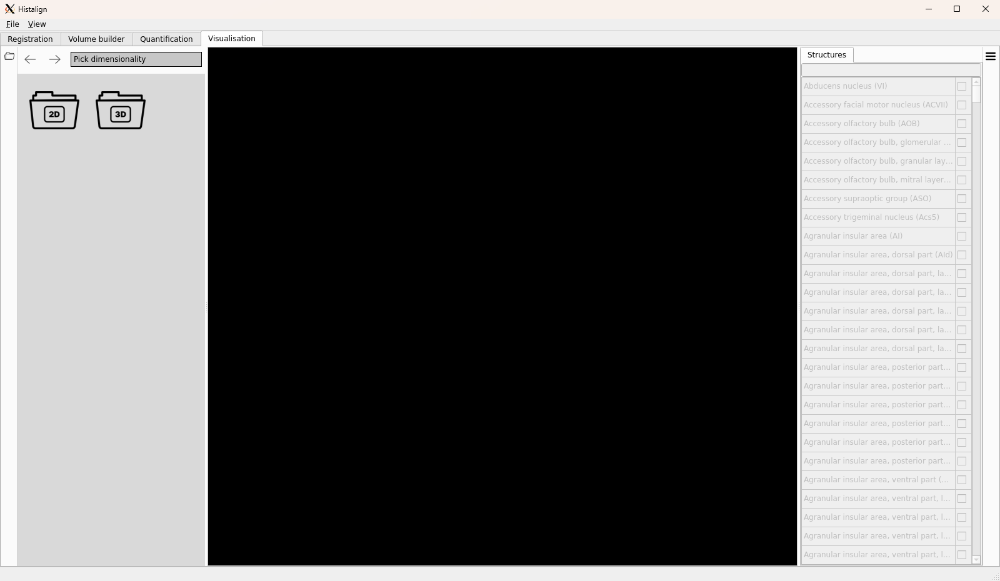

Visualisation is the final functionality of `histalign`. It allows you to inspect the alignment you produced on your 2D slices, or the interpolation of the 3D volume on the three main axes (coronal, horizontal, and sagittal).

## The visualisation GUI

The GUI consists of a central view where either the 2D or 3D visualisation will take place.  
On the left, you can pick to see 2D data for the project or 3D generated volumes.

### 2D visualisation

If you are interested in seeing contours of structures on your 2D slices, you should double-click on the 2D folder icon. This will show you a list of the image folders that have at least one image registered. Simply double click the folder you are interested in and you will see the list of registered images in thumbnail form.

By double-clicking an image, you can open it in the central view which will activate the "Structure" tab on the right-hand side.

***TODO: Fix contour overlaying and complete documentation to include examples.***

### 3D visualisation

Similar to 2D visualisation, viewing volumes requires double-clicking the 3D folder icon. This will show you a list of the image folders for which a volume has been built. Each entry will be the path to an image folder that you have registered. Double-clicking any of the entries will open the volume in the central view.

Once a volume has been opened, you will see a simplified FMRI view showing coronal, horizontal, and sagittal slices of the volume. By default, the larger view shows a larger version of the corona slice.

#### Slicing through the volume

To move along the 3D volume, you can scroll over the small view that is currently displayed in the larger one.  
Scrolling up increases the index, while scrolling down decreases it. Since the CCF origin in the most anterior, superior, left point (ASL), scrolling up/down on the coronal view moves rostral/caudal, ventral/dorsal on the horizontal view,  and further right/left on the sagittal view.

#### Changing the primary view

If you wish to change the primary view to use a different slicing, click on the  icon in the top right of the view you wish to prioritise.

#### Interacting with the primary view

The primary view is, as always, zoomable and draggable. To zoom, use the scroll wheel. To move around, use the left mouse button.
