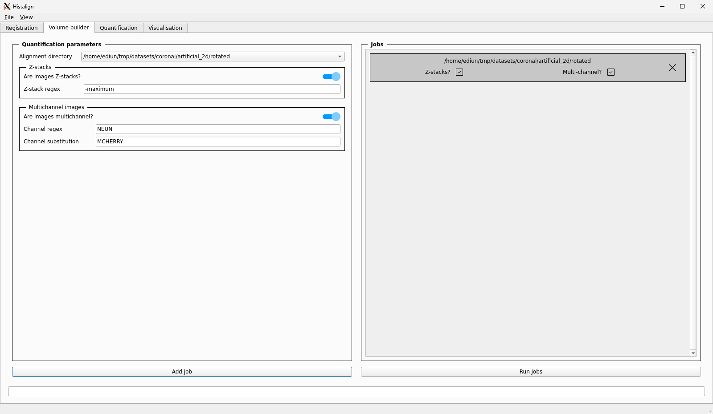

It is now time to explorer another tab of the application, the "Volume builder" tab above the tool bar.  

Clicking the tab will bring you to the following interface:

This interface allows you to use the alignment settings you provided for your images and reconstruct a 3D volume from them. This volume can then be used for [quantification](quantifying.md) and can be [visualised](visualisation.md).

### Selecting an alignment directory

The first option of the "quantification parameters" is a combo box that lets you select an alignment folder to quantify.  
If you used a single image directory in this project, the directory should already be selected. If you had done multiple, using the combo box would allow you to pick the one you which to work with.

### Working with Z-stacks

If during [data preparation](data-preparation.md) you projected your images to align them but you want to build the volume using all the info of your stacks, you can toggle the Z-stack checkbox.  
Doing so will enable the input box where you can provide the part of the file name of the projected image that indicates it is a projection. This should be set up in such a way that remove that portion of the file name points to a valid path to your stack.

Using Z-stacks helps in building a more true-to-life volume by minimising the work the interpolator has to do when reconstructing the volume. Instead, `histalign` will apply the same alignment to all the images in the stack but insert them at the proper coordinates as if your alignment was done on the midpoint of the stack.

!!! Example
    Let's say your project images use the naming scheme `ANIMAL_ID-EXPERIMENT_ID-DATE-maximum.tiff` and your Z-stacks are named the same, but without the `-maximum` portion. You can tell `histalign` to use the Z-stacks by providing `-maximum` as the Z-stack regex.

### Working with multi-channel images

Similarly to Z-stacks, it is possible to align channel A and build a volume with channel B or C. The logic is similar to the Z-stack interface. To tell `histalign` to use a different channel, toggle the "Multichannel images" checkbox and enter the part of the file name that corresponds to the channel ID in your alignment images. If you are familiar with regular expressions, you can make full use of them here. If not, you can just provide verbatim the name of the channel (e.g, NEUN, MCHERRY).

!!! Example
    Let's say your project images use the naming scheme `ANIMAL_ID-EXPERIMENT_ID-DATE-neun.tiff` where `-neun` is the name of the channel in the image. If you quantified using this NeuN channel (i.e., file names end in `-neun.tiff`), you can tell `histalign` to use mCherry channel (i.e., file names end in `-mcherry.tiff`) for building the volume by providing the `neun` regex and the substitution `mcherry`.  
    Now, instead of loading the NeuN files to build the volume, the mCherry files will be loaded instead.  

    As mentionned previously, you should make sure those files exist in the same folder.

## Putting it together

Going by the examples presented above, you would set up the interface as follows to prepare to build the volume:

You can see in the screenshot that there is now a job located in the right pane. It was added after filling in the input fields and pressing the "Add job" button.  

The volume building interface uses a system of jobs to allow queueing multiple operations at once on different alignment directories. This can be useful when you've aligned a few directories and now wish to build a few volumes in the background while you work on something else.

!!! note
    Currently, only a single volume per alignment directory is kept. This means that queuing multiple jobs for the same alignment directory will result in any job before the final one being overwritten. Since there is no check the ensure a single job is run per directory, you should make sure there aren't any duplicates yourself.

When you are happy with the queued jobs, you can click the "Run jobs" button. The progress bar at the bottom of the window will start displaying progress of the volume building. This step can take a few seconds to a few hours depending on the resolution that you used for the project and the hardware of your machine.  
Once all the volumes have been built, the progress bar will show 100% completion and you can go back to using the application.

## Exporting 3D volumes

Once you have fully built the volumes for an image directory, you are given the option to export them to use them with other software or your own pipeline. To export the volumes, go to "file" in the menu bar, then  "Export volume". This will pop up a small dialog asking you which volume to export, and from which image directory, as well as where you want the exported volumes to go.

Simply select or type the path to the folder to export to and the volume files will be copied over.   
Said files will be in the [HDF5 format](https://www.hdfgroup.org/solutions/hdf5/) and can easily be opened in your own scripts using [`h5py`](https://docs.h5py.org/en/stable/index.html). Additionally, you can use the [`histalign` Python API](../../reference/API/histalign/io/index.html#histalign.io.load_volume) (with `as_array = True`) to load the volumes as NumPy arrays.

!!! Info
    The volumes are stored as the only group, named `array`, in their respective files.  
    
    The shape of the data is 3D with the most Anterior-Superior-Left (ASL) point being the origin, as per the Allen CCF coordinates. To find the coordinates of a point in that volume in CCF coordinates, simply take its index and multiply it by the resolution of your project.

## What's next?

If you're happy to keep going and run quantification on the volume, you can move on to the [quantifying](quantifying.md) tutorial.
If you first want to have a look at the volume to see the result of the interpolation, you can move on to [visualisation](visualisation.md).  
