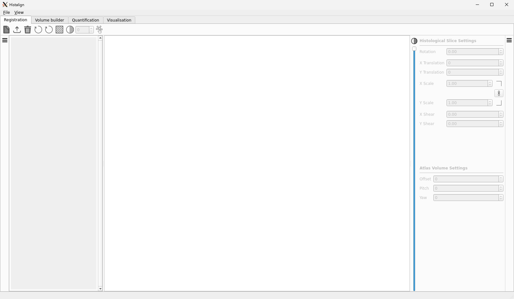
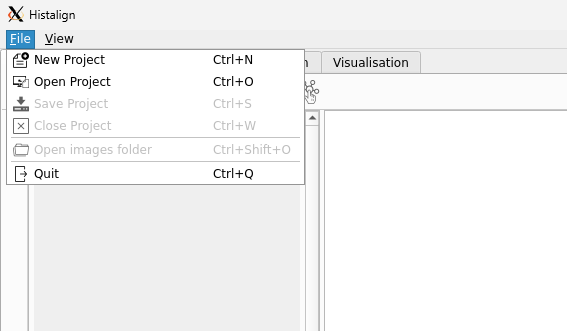
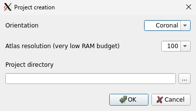

Now that your data is ready, you can finally start the application.  
To do so, simply run the command `histalign` in your command line. When you run that command, the following interface should eventually show up:

This is the main graphical interface for the application. It is composed of multiple tabs that will be explored later on. For now, the current tab, registration, is what we are interested in.

The tab is split into three sections. On the left is the thumbnail view which will be populated when we have opened an image directory. On the right is the settings view which is where we'll be able to control the affine transform of the alignment. Finally, the middle section is where we will see the images being aligned superimposed on the ABA.  
You will also notice the tool bar between the tab name and the three sections. This bar provides buttons for commonly used actions and we will explore it more as we go along.

## Creating a project

`histalign` works with what are called "projects". A project can be used to analyse data for a single animal or help you group multiple animals into a single experimental project. The choice is up to you but it is recommended to try and keep a project per experiment.

To create your first project, click on the file menu in the top-left, on the menu bar. This will pop up a menu with a few options that looks like this:

This menu shows the options to create, open, save, and close the project. To create a new project, click on "New project" or press Ctrl+N on Window and Linux (Cmd+N on macOS).

Another pop-up will appear, asking you to set a few settings for your project.

### Orientation

This is the orientation of your images. You have the choice between coronal, horizontal, and sagittal.

### Resolution

This is the resolution of the ABA to use. Available options are 100, 50, 25, and 10 microns. Depending on the machine you are using and how much RAM it has available, you might not be able to create a project with a higher resolution. If you are unsure, do not go to a higher resolution (lower value) than 25.

It is currently not possible to change the resolution once the project has been created so make sure it is appropriate for the level of resolution you will need when quantifying.

### Project directory

This is where you project will be created. You can either paste a path of your choosing and use the button on the right-hand side of the input box to open a dialog allowing you to pick a path.

Note that when creating a project, the contents of the directory provided will be erased so make sure you are selecting a directory that is empty. If it is not, you will be asked to confirm you know what you are doing.

## What's next?

Once you have chosen the right settings for your project, click the "OK" button to create your project. If this is your first time using the resolution you provided, the relevant atlas will be downloaded from th Allen Institute's web API. This can take a few seconds to a few minutes depending on the resolution and your connection speed. When it has been downloaded, it will be loaded and displayed in the central view.  

When that is done, you are ready to move on to [registration](registration.md).
